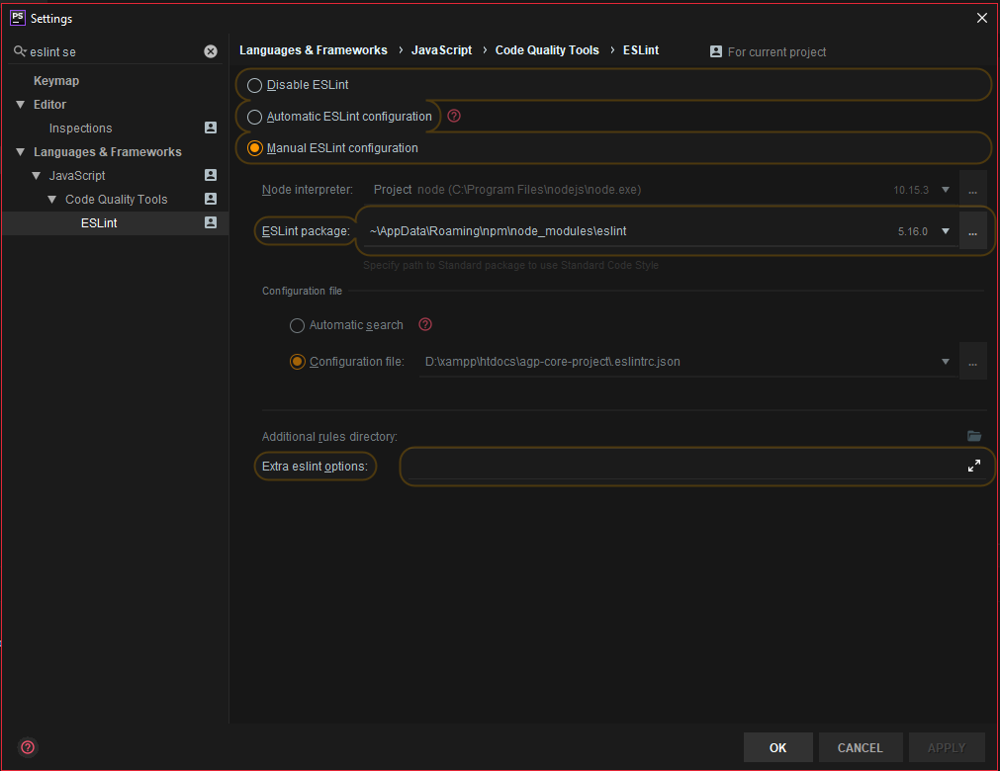
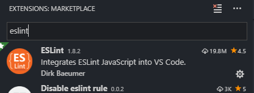

# Eslint Setup 
## Prerequirements
- After cloning any Agp project, you need to run the setupproject.php script
```
php setupproject.php
```
This script will create a .eslintrc.json file at the root of the project , which includes all the rules we need.
- go to core/_buildfiles and run : 
```
npm run installEslint
```
This script installs all the requirements for Eslint.
## Setup Eslint in the IDE
### Phpstorm
If you are using Phpstorm this should be straightforward. Just open the setting , go to Languages and frameworks/Javascript/Code Quality Tools/Eslint/
<div>
  
</div>

- Select Manual ESLint configuration
- Select the local installed eslint package (!important global installed lint packages do not work)
- Select the .eslintrc.json file created at the root directory
- You are ready to go !

### Visual Studio Code
 
- Go to Extensions and Install eslint
<div style="text-align:center">
  
</div>

- If you have prettier installed please disable it for this workspace (!important)
- Go to Settings/Workspace settings/ open settings (json) and add the following settings
```javascript
{
  "eslint.validate": [
    { "language": "javascript", "autoFix": true },
    { "language": "markdown", "autoFix": true },
    { "language": "typescript", "autoFix": true },
    //you can add other languages if you want to
  ],
  "files.autoSave": "off",
  "eslint.enable": true,
  "eslint.autoFixOnSave": true
}
```
- You need to restart Visual Code Studio
