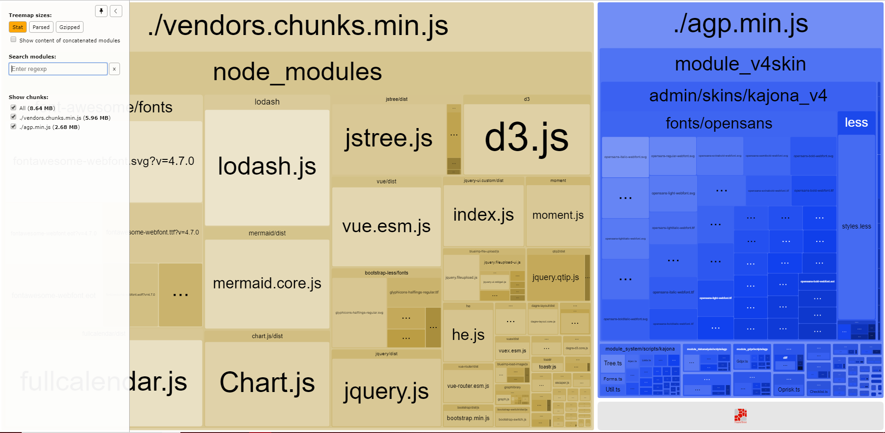

# Webpack

Our frontend-build-process is now using Webpack. 3 types of build are available : 

## Development
This build process is basically used during development. It runs the live-reload dev-server which reloads the page you are working on and rebuilds the bundles every time you save your changes in the IDE.
To run this script , cd with your terminal to core/_buildfiles/ and run 
```
npm run dev
```

### Live reload Server
To use this feature you need to edit the script tag found in core/modules_v4skin/admin/skins/kajona_v4/main.twig
```html
<script src="http://localhost:35729/livereload.js"></script>
```
- Edit localhost if you are using a custom Domain name. For exampel if you default Domain name is set to dev.artemeon.de the script tag should be 
```html
<script src="http://dev.artemeon.de:35729/livereload.js"></script>
```

- If you changed the hostname you need to change the settings found in core/_buildfiles/webpack.config.js

```javascript
const liveReloadOptions = {
    hostname: 'localhost',
    protocol: 'http'
}
```
- Port-number can as well be changed
- After editing the settings just make sure to not commit the changes when pushing (!important)

## Production
The production build does not run the live server and it takes a little bit longer to compile. It makes the bundle a lot smaller than the development one due to all the compression and optimization algorithms.
To run this script , cd with your terminal to core/_buildfiles/ and run 
```
npm run build
```

## Bundle Analysis
We use this script to analyse the final (prod) bundle and search for duplicates and possible optimizations. To run this script , cd with your terminal to core/_buildfiles/ and run 
```
npm run analyse
```
This will run a diffrent webpack.config file (similar to the prod one) and after building the bundle it runs a webview containing a graphical representation of the diffrent bundles (agp.min.js + vendors.chunks.min.js)

 <div style="text-align:center">
  
</div>

## Environment Variables
Our webpack config supports environment variables. In core/_buildfiles you find 2 files where you can define your variables 
- .env.dev : is for dev usage 
- .env.prod : is for prod usage

To access the variables you already defined use 

```javascript
process.env._NAME_OF_YOUR_VARIABLE
```
and webpack will know which file to use based on the mode of the build.
### Use case
Define the url of the Api
- Dev : 
```javascript
axios.get(process.env.REST_API_URL+'/getUser'); // will return for example http://dev.artemeon.de/get
```

- Prod :
```javascript 
axios.get(process.env.REST_API_URL+'/getUser'); // will return for example http://localhost/get
```
Be creative !